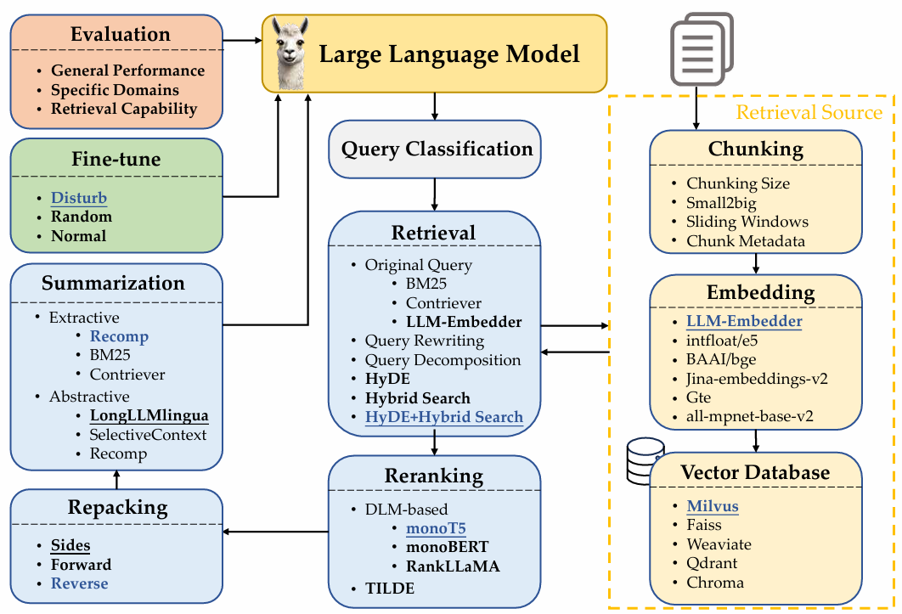
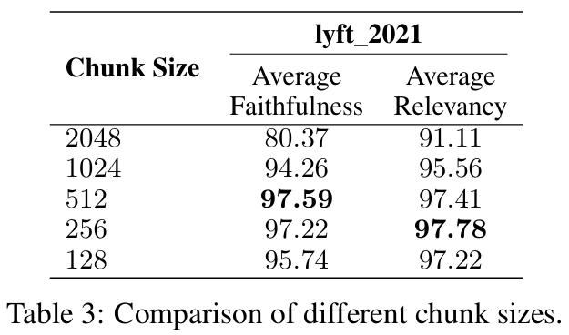
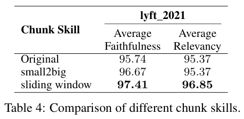
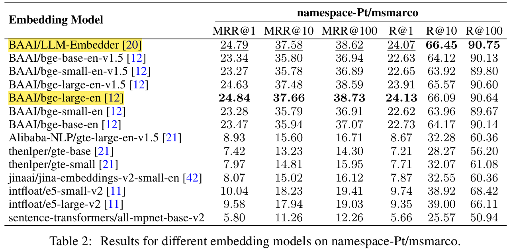
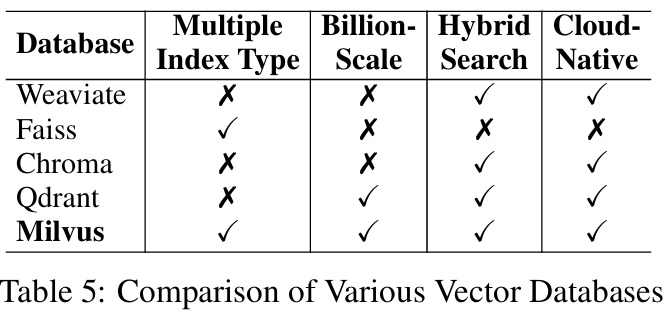
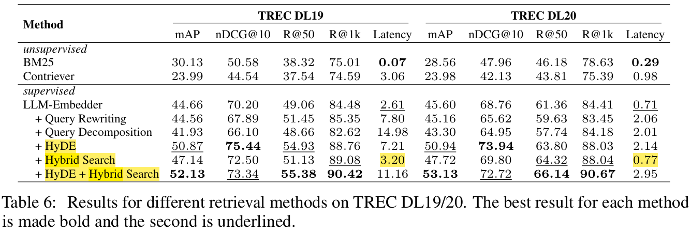
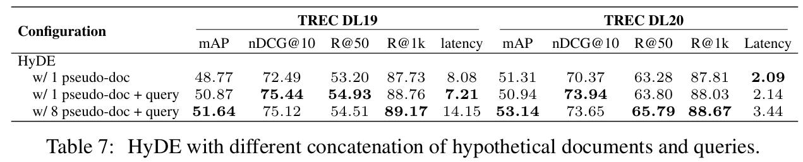
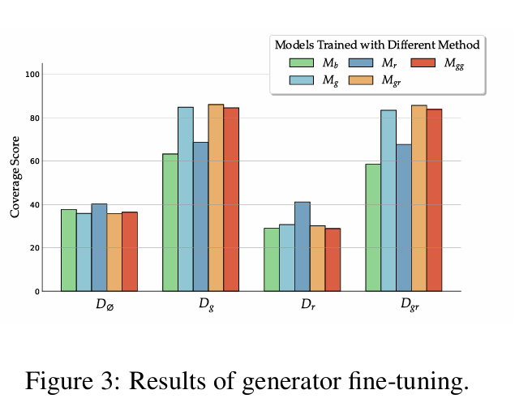
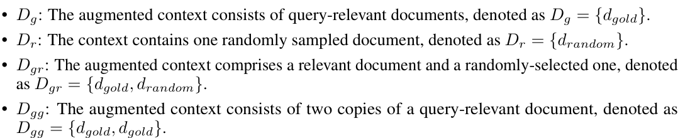
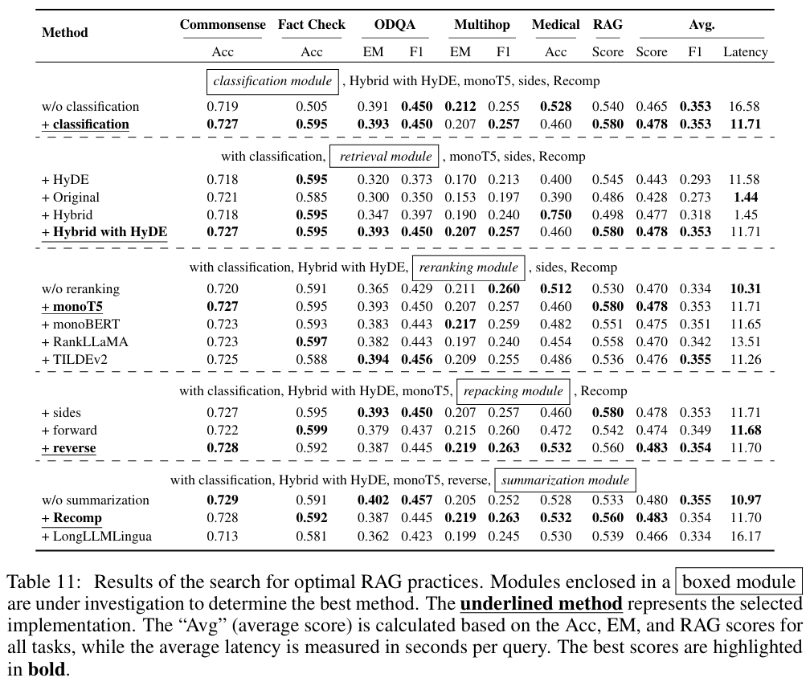

# Paper Review Summary: Searching for Best Practices in Retrieval-Augmented Generation

## Overview

This article reviews a paper that organizes the modular components of RAG (Retrieval-Augmented Generation), explains techniques that can be used at each stage, and examines which combinations are effective in terms of both performance and efficiency through multiple experiments.

RAG is an approach designed to address the limitations of existing LLM-based applications.

- **Hallucination problem**: LLMs are strong at generating natural sentences, but they do not always guarantee factual accuracy.
- **Knowledge bias and freshness problem**: It is difficult to reflect information after the training cutoff or specialized domain knowledge.
- **Cost problem**: Fine-tuning an LLM every time is expensive and operationally burdensome.

Therefore, RAG has become practically important because it improves answer quality by retrieving external knowledge without directly modifying the LLM itself.

---

## 1. Introduction

### Key Points

- Organizes the RAG process step by step.
- Compares performance and efficiency across various experimental settings.
- Discusses the possibility of extending RAG to multimodal retrieval.

### RAG Workflow

!

The RAG workflow is generally composed of the following steps.

1. **Query Classification**
   - Determines whether retrieval is necessary for the input question.
   - Applying RAG to every question may increase latency unnecessarily.

2. **Retrieval**
   - Searches an external database for information related to the question.
   - At this stage, choices such as chunking, embedding model, and vector database are important.

3. **Reranking**
   - Reorders retrieved documents based on relevance to the question.

4. **Document Repacking**
   - Rearranges retrieved documents so that the LLM can use them more effectively.

5. **Summarization**
   - Summarizes only the key information from retrieved documents to reduce context length and redundancy.

6. **Generator Fine-tuning**
   - Tunes the LLM responsible for answer generation for the target task.

7. **Evaluation**
   - Evaluates answer quality, faithfulness, relevance, and related metrics.

---

## 2. Related Work

### 2.1 Query and Retrieval Transformation

There are methods that transform either the query or the retrieval source to improve retrieval performance.

- **Query2Doc / HyDE**
  - Generates a pseudo-document from the question and uses it for retrieval.
- **TOC**
  - Decomposes the question into multiple sub-questions, retrieves information for each, and then integrates the results.
- **Document-to-query approach**
  - Generates hypothetical queries from documents to improve retrieval performance.

### 2.2 Retriever Enhancement Strategy

Representative areas for improving retriever performance include the following.

- Chunking
- Embedding
- Reranking

### 2.3 Retriever and Generator Fine-tuning

- **Retriever fine-tuning**
  - Improves retrieval quality by optimizing the embedding model and reranking model.
- **Generator fine-tuning**
  - Trains the LLM to better use retrieved documents when generating answers.

---

## 3. RAG Workflow

## 3.1 Query Classification

RAG does not always need to be used. Efficiency improves when the system first classifies whether retrieval is necessary depending on the question type.

Examples:

- Translation: RAG not required, classified as 'Sufficient'
- Summarization: RAG not required, classified as 'Sufficient'
- Search: RAG required, classified as 'Insufficient'
- Suggestion: RAG required, classified as 'Insufficient'

Classifier finetuning:

- Model: BERT-base-multilingual-cased
- Batch Size: 16
- Learning Rate: 1e-5
- Dataset: Generated based on subset of the Databricks-Dolly-15K

---

## 3.2 Chunking

Chunking is the process of splitting documents into searchable units.

Possible approaches include the following.

- **Token-level**
  - Simple, but it may damage sentence-level meaning.
- **Semantic-level**
  - Can split text by semantic units, but the cost is high.
- **Sentence-level**: Our choice
  - Splits text by sentence and balances meaning preservation with efficiency.

### 3.2.1 Chunk Size



There is a trade-off in chunk size.

- Large chunks
  - Helpful for understanding context.
  - May increase retrieval time and cost.
- Small chunks
  - May be efficient for retrieval.
  - May lack sufficient context.

Evaluation metrics:

- Faithfulness: measures whether the response is hallucinated or grounded in the retrieved content.
- Relevancy: measures how well the retrieved content and the response align with the query.

Experimental setup:

- Framework: LlamaIndex
- Embedding model: text-embedding-ada-002
- Generation model: zephyr-7b-alpha
- Evaluation model: gpt-3.5-turbo
- Chunk overlap: 20 tokens
- Dataset: Lyft 2021

Optimal Chunk Size: 256 

### 3.2.2 Chunking Techniques



Representative chunking techniques:

- **Small-to-big**
  - Matches a small chunk with the query and returns a larger chunk as context.
- **Sliding window**
  - Maintains contextual continuity between adjacent chunks.

Experimental setup:

- Embedding model: LLM-Embedder
- Small chunk: 175 tokens
- Large chunk: 512 tokens
- Chunk overlap: 20 tokens
- Dataset: Lyft 2021


### 3.2.3 Embedding Model Selection



The embedding model is a key component that calculates semantic relevance between the query and chunks. In the paper, LLM-Embedder and text-embedding-ada-002 show similar performance, but LLM-Embedder is selected because it is lighter.

Experimental setup:

- Evaluation framework: FlagEmbedding evaluation module
- Query dataset: namespace-Pt/msmarco
- Corpus dataset: namespace-Pt/msmarco-corpus

### 3.2.4 Metadata Addition

Adding metadata such as title, keywords, or pseudo-queries to chunks can improve retrieval performance.

---

## 3.3 Vector Databases



A vector database is a database for efficiently storing and retrieving embedding vectors.

Main types or characteristics:

- Multiple index types
- Billion-scale vector support
- Hybrid search
- Cloud-native capabilities

---

## 3.4 Retrieval Methods



To improve retrieval performance, the query can be transformed instead of being used as-is.

Representative methods:

- **Query Rewriting**
  - The LLM rewrites the query into a form better suited for retrieval.
- **Query Decomposition**
  - Splits a complex question into sub-questions.
- **Pseudo-document Generation**
  - Generates a hypothetical document from the query, as in HyDE, and uses it for retrieval.

Baseline:

- Sparse retrieval: BM25
- Dense retrieval: Contriever

### 3.4.2 HyDE



In HyDE, increasing the number of pseudo-documents may improve performance, but it also increases latency. The paper considers one pseudo-document sufficient when efficiency is taken into account.

### 3.4.3 Hybrid Search

This method combines sparse retrieval and dense retrieval.

```text
S_h = α · S_s + S_d
```

The paper compares performance changes by adjusting the α value and selects α = 0.3.

---

## 3.5 Reranking Methods

Reranking is the stage that reorders retrieval results and provides more relevant documents to the LLM.

Representative methods:

- **DLM Reranking**
  - Judges query-document relevance as a classification task.
  - Adjusts rankings based on the true probability.
- **TILDE Reranking**
  - A query-likelihood-based method.
  - Has advantages in terms of efficiency.

Experimental models:

- monoT5
- monoBERT
- RankLLaMA
- TILDEv2

Dataset: MSMARCO

---

## 3.6 Document Repacking

This stage determines the order in which retrieved documents are placed into the LLM context.

- **Forward**
  - Places documents in descending order of reranking score.
- **Reverse**
  - Places documents from lower score to higher score.
- **Sides**
  - Places important documents at the beginning and end of the context.

This is related to the observation that models can use information better when important information appears at the beginning or end of the context.

---

## 3.7 Summarization

Summarizing retrieved documents can improve generation efficiency and reduce redundancy.

Methods:

- **Extractive summarization**
  - Selects sentences to create a summary.
- **Abstractive summarization**
  - Integrates information from multiple documents and creates a new summary.

Representative methods:

- Recomp
- LongLLMLingua
- SelectiveContext

Experimental datasets:

- NQ
- TriviaQA
- HotpotQA

As a result, Recomp’s abstractive method showed strong performance, and LongLLMLingua is notable for showing reasonably good performance even on unseen data.

---

## 3.8 Generator Fine-tuning





The paper fine-tunes Llama-2 7B-based models on several datasets and compares performance across validation sets. A model trained on mixed data tends to work robustly across diverse datasets and effectively use relevant documents.

---

## 4. Searching for Best RAG Practices

After selecting strong candidates from experiments for each module, the paper explores the best RAG process through combination experiments.

Experimental scenarios:

1. Commonsense Reasoning
2. Fact Checking
3. Open-Domain QA
4. Multi-Hop QA
5. Medical QA

Evaluation metrics:

- Accuracy
- Exact Match
- F1 score
- Faithfulness
- Context Relevancy
- Answer Relevancy
- Answer Correctness



Key results:

- **Query Classification**
  - Contributes to both performance and efficiency.
- **Retrieval**
  - Hybrid with HyDE performs well, but latency is high.
  - Considering efficiency, Hybrid or Original retrieval is more practical.
- **Reranking**
  - Removing it tends to significantly degrade performance, indicating its importance.
- **Repacking**
  - The Reverse setting showed strong results.
- **Summarization**
  - Recomp performs well, but it can be removed when efficiency is prioritized.

---

## 5. Discussion

### Summary of Experimental Results

The trade-off between performance and efficiency should be considered.

| Module               | Performance Maximization | Efficiency-Balanced Choice |
| -------------------- | ------------------------ | -------------------------- |
| Query Classification | Use                      | Use                        |
| Retrieval            | Hybrid with HyDE         | Hybrid                     |
| Reranking            | monoT5                   | TILDEv2                    |
| Repacking            | Reverse                  | Reverse                    |
| Summarization        | Recomp                   | Recomp or omit             |

---

## Multimodal Extension

RAG can be extended beyond text into multimodal environments.

### Text-to-Image Retrieval

- Searches for similar images using a text query.
- Returns a similar image if one exists.
- If no similar image exists, an image generation model can generate one.

### Image-to-Text Retrieval

- Searches for similar images using an image query.
- Returns a caption if a similar image is found.
- If not, an image captioning model generates a description.

Applying RAG to multimodal settings can reduce inaccuracy, inefficiency, and maintenance issues that may arise when using only generative models.

---

## Limitation

- The fine-tuning in this study mainly focuses on the generator LLM.
- It does not sufficiently cover the direction of jointly training the retriever and generator.
- Since the focus is on comparing representative techniques for each module, it does not cover a broader range of chunking and retrieval strategies.

---

## Key Takeaways

- RAG is not a single technique, but a workflow that combines query classification, retrieval, reranking, repacking, summarization, and fine-tuning.
- Applying RAG to every query can be inefficient, so query classification is important.
- In retrieval, Hybrid with HyDE is advantageous in terms of performance, but it has a large latency trade-off.
- Reranking has a major impact on performance, and in practice both performance and latency should be considered.
- In document repacking, strategies that place important information at the end or beginning of the context can be effective.
- Summarization is useful for context compression, but additional cost and latency should be considered.
- Best practice should be selected not as the “highest-performing combination,” but as the “balance point between performance and efficiency.”
